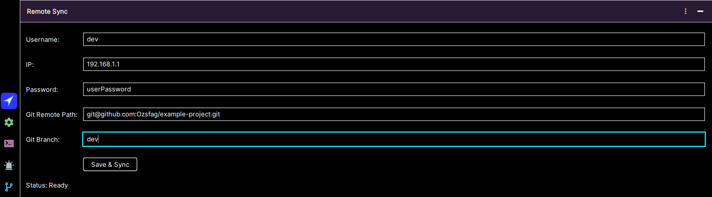
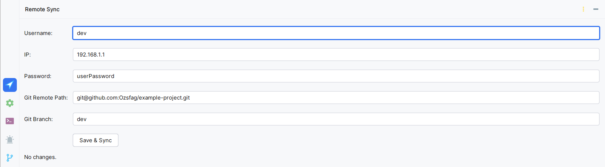

# 📦 Remote Sync

> **Sync your Git changes to a remote server over SSH – automatically.**

Remote Sync is a plugin for IntelliJ IDEA that monitors changes in your local Git repository and synchronizes them with
a remote server over SSH.

---

## 🚀 Features

- 📤 Automatically upload new and modified files
- 🗑️ Remove deleted files from the server
- 🛠️ SSH configuration (user, key or password, host, and path)
- 🌿 Support for any Git branches
- 💡 Intuitive UI right inside IntelliJ

---

## 🖼️ Interface

### 🌙 Dark Theme

### ☀️ Light Theme

The plugin is located in the bottom tool window panel. Just set up the configuration and click **Save & Sync** —
everything else will happen automatically.

---

## 🚀 Getting Started

1. Go to **Settings → Plugins** in IntelliJ IDEA.
2. Open the **Marketplace** tab and search for **Remote Sync**.
3. Click **Install** and restart your IDE.

Or install manually:

- Download the `.zip` file from [JetBrains Marketplace](https://plugins.jetbrains.com/).
- Go to **Settings → Plugins → ⚙ → Install Plugin from Disk**.

Once installed:

1. Open the **Remote Sync** tab in the bottom panel of the IDE.
2. Fill in the fields:
    - `Username` — SSH username
    - `IP` — server IP address
    - `Password` or `Private Key Path`
    - `Git Remote Path` — for example, `git@github.com:user/project.git`
    - `Git Branch` — the branch to monitor
3. Click **Save & Sync** — the plugin will compare and synchronize files automatically.

---

## 📂 Source Code

The source code is available on GitHub:  
🔗 [https://github.com/Ozsfag/remote-sync-plugin](https://github.com/Ozsfag/remote-sync-plugin)

---

## 📜 License

License: [Apache License 2.0](https://www.apache.org/licenses/LICENSE-2.0)

---

## ✉️ Feedback

Bug reports and feature requests:  
[Open an issue on GitHub](https://github.com/Ozsfag/remote-sync-plugin/issues)